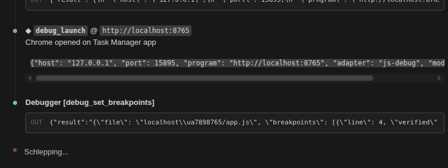

# claude-mcp-debugger

[English](README.md) | [Español](README.es.md)

Un serveur MCP de debug pour agents IA de code. Débuggez **Python, Node.js, Java et JavaScript navigateur** — comme un développeur dans VS Code.

Compatible avec tout agent IA supportant [MCP](https://modelcontextprotocol.io/) — optimisé pour **Claude Code** avec installation en une commande.

> **N'importe quel agent IA, n'importe quel langage, sans IDE.** Ce serveur parle le Model Context Protocol standard — il fonctionne avec Claude Code, mais aussi avec tout client MCP (Cursor, Windsurf, agents custom, pipelines CI/CD). Pas besoin de VS Code, d'IDE, ni d'interface graphique.

<p align="center">

</p>

## Langages supportés

| Langage | Adaptateur | Auto-setup | Prérequis |
|---------|-----------|------------|-----------|
| Python | [debugpy](https://github.com/microsoft/debugpy) | `pip install` au premier lancement | Python 3.10+ |
| Node.js | [vscode-js-debug](https://github.com/microsoft/vscode-js-debug) | Téléchargé au premier usage | Node.js 18+ |
| Java | [JDT LS](https://github.com/eclipse-jdtls/eclipse.jdt.ls) + [java-debug](https://github.com/microsoft/java-debug) | Téléchargé au premier usage (~55 Mo) | JDK 17+ |
| JS navigateur | vscode-js-debug (pwa-chrome) | Partagé avec Node.js | Chrome/Chromium |

## Fonctionnalités

- **22 outils de debug** : cycle complet — lancement, breakpoints, exécution pas à pas, inspection, modification de variables, et plus
- **Multi-langage** : Python, Node.js, Java et JavaScript navigateur via une interface unifiée
- **Debug navigateur** : débugger du JS client dans Chrome/Chromium — breakpoints, capture de clics, inspection du DOM. Fonctionne avec les serveurs de dev locaux et les URLs distantes
- **Autonome** : aucun IDE requis — fonctionne en headless, en CI/CD, partout où un client MCP tourne
- **Auto-setup** : tous les adaptateurs et dépendances sont téléchargés automatiquement au premier usage
- **Détection intelligente** : auto-détection du langage par extension, détection du venv projet (Python), compilation avec infos de debug (Java)
- **Breakpoints avancés** : conditionnels, par compteur, logpoints, et par nom de fonction
- **Expansion de variables** : exploration des dicts, listes et objets avec profondeur configurable et filtrage des internals
- **Modification en direct** : changer la valeur des variables pendant l'exécution
- **Détails d'exception** : affichage automatique du traceback lors d'un arrêt sur exception
- **Multi-plateforme** : fonctionne sur Linux, macOS et Windows

## Installation

### Claude Code (recommandé)

**Linux / macOS :**

```bash
curl -fsSL https://raw.githubusercontent.com/bastiencb/claude-mcp-debugger/main/install.sh | bash
```

**Windows (PowerShell) :**

```powershell
irm https://raw.githubusercontent.com/bastiencb/claude-mcp-debugger/main/install.ps1 | iex
```

> En cas d'erreur de politique d'exécution, lancez d'abord `Set-ExecutionPolicy -Scope CurrentUser RemoteSigned`.

> **Que fait cette commande ?** Le script copie le serveur dans `~/.claude/mcp_debugger/` et ajoute une entrée dans votre configuration MCP Claude Code. C'est tout — consultez le source de [install.sh](install.sh) / [install.ps1](install.ps1) avant de l'exécuter.

**Après l'installation, redémarrez Claude Code.** Le debugger sera disponible dans tous vos projets.

<details>
<summary><b>Claude Code — installation manuelle</b></summary>

**1. Copier les fichiers :**

```bash
git clone https://github.com/bastiencb/claude-mcp-debugger.git
cp -r claude-mcp-debugger/mcp_debugger ~/.claude/mcp_debugger   # Linux/macOS
# Windows : Copy-Item -Recurse claude-mcp-debugger\mcp_debugger $env:USERPROFILE\.claude\mcp_debugger
```

**2. Créer le venv et installer les dépendances :**

```bash
python3 -m venv ~/.claude/mcp_debugger/.venv
~/.claude/mcp_debugger/.venv/bin/python3 -m pip install "mcp[cli]>=1.0" debugpy
# Windows : utiliser .venv\Scripts\python.exe au lieu de .venv/bin/python3
```

**3. Enregistrer dans Claude Code :**

```bash
claude mcp add -s user -t stdio debugger -- ~/.claude/mcp_debugger/.venv/bin/python3 -m mcp_debugger
# Windows : claude mcp add -s user -t stdio debugger -- %USERPROFILE%\.claude\mcp_debugger\.venv\Scripts\python.exe -m mcp_debugger
```

> Ceci écrit dans `~/.claude.json` (la config Claude Code). Vérifiez avec `claude mcp list`.

Puis redémarrez Claude Code.

</details>

<details>
<summary><b>Autres clients MCP (Cursor, Windsurf, agents custom...)</b></summary>

Clonez le dépôt où vous voulez et pointez votre client MCP vers le serveur :

```bash
git clone https://github.com/bastiencb/claude-mcp-debugger.git /path/to/claude-mcp-debugger
```

Ajoutez dans la configuration MCP de votre client :

```json
{
  "command": "python3",
  "args": ["-m", "mcp_debugger"],
  "cwd": "/path/to/claude-mcp-debugger",
  "env": { "PYTHONPATH": "/path/to/claude-mcp-debugger" }
}
```

Le serveur expose 22 outils préfixés `debug_` — n'importe quel client MCP peut les utiliser.

</details>

### Prérequis

- Python 3.10+ (requis — le serveur lui-même est en Python)
- Node.js 18+ (optionnel, pour le debug JavaScript/TypeScript)
- JDK 17+ (optionnel, pour le debug Java)
- Chrome ou Chromium (optionnel, pour le debug JavaScript navigateur)

## Utilisation

Une fois installé, votre agent IA peut débugger du code. Ces exemples montrent Claude Code, mais les mêmes outils fonctionnent identiquement depuis n'importe quel client MCP.

**Python :**
```
Vous : Débugge mon script app.py — il plante à la ligne 42

Claude : [lance debug_launch sur app.py]
         [pose un breakpoint à la ligne 42]
         [continue l'exécution]
         [inspecte les variables quand le breakpoint est atteint]
         [trouve le bug et l'explique]
```

**Node.js :**
```
Vous : Débugge server.js — l'endpoint /api/users renvoie des données incorrectes

Claude : [lance debug_launch avec language="node" sur server.js]
         [pose un breakpoint dans le handler de la route]
         [inspecte les objets request et response]
         [identifie le bug dans la logique de requête]
```

**Java :**
```
Vous : Débugge Main.java — l'algorithme de tri produit un mauvais résultat

Claude : [lance debug_launch sur Main.java — compile automatiquement avec javac -g]
         [pose un breakpoint dans la méthode de tri]
         [inspecte le contenu du tableau et les variables de boucle]
         [évalue des expressions : names.size(), scores.get("Alice")]
```

**Navigateur (Chrome) :**
```
Vous : Débugge mon frontend — la validation du formulaire échoue au submit

Claude : [lance debug_launch sur http://localhost:3000]
         [pose un breakpoint dans validator.js]
         ... vous cliquez "Envoyer" dans Chrome ...
         [capture le clic, inspecte les données du formulaire et les erreurs]
         [trouve le bug dans la logique de validation]
```

## Outils

| Outil | Description |
|-------|-------------|
| **Session** | |
| `debug_launch` | Lancer un programme sous le debugger (Python, Node.js, Java, navigateur) |
| `debug_stop` | Arrêter la session immédiatement (SIGTERM) |
| `debug_terminate` | Terminaison gracieuse (KeyboardInterrupt, les handlers de nettoyage s'exécutent) |
| `debug_status` | Vérifier l'état de la session, la position et les capacités |
| **Breakpoints** | |
| `debug_set_breakpoints` | Poser des breakpoints avec conditions, compteurs ou logpoints |
| `debug_set_function_breakpoints` | S'arrêter quand une fonction nommée est appelée |
| `debug_set_exception_breakpoints` | S'arrêter sur les exceptions levées/non gérées |
| **Exécution** | |
| `debug_pause` | Mettre en pause un thread en cours (ex. boucle infinie) |
| `debug_continue` | Reprendre jusqu'au prochain breakpoint ou la fin |
| `debug_step_over` | Exécuter la ligne courante, s'arrêter à la suivante |
| `debug_step_into` | Entrer dans l'appel de fonction de la ligne courante |
| `debug_step_out` | Exécuter jusqu'au retour de la fonction courante |
| `debug_goto` | Sauter à une ligne sans exécuter le code intermédiaire |
| **Inspection** | |
| `debug_stacktrace` | Obtenir la pile d'appels |
| `debug_variables` | Inspecter les variables locales/globales (avec marqueurs expansibles) |
| `debug_expand_variable` | Explorer le contenu des dicts, listes, objets |
| `debug_evaluate` | Évaluer une expression dans le contexte |
| `debug_exception_info` | Obtenir le type, message et traceback d'une exception |
| `debug_source_context` | Afficher le code source autour de la ligne courante |
| `debug_modules` | Lister les modules chargés |
| **Modification** | |
| `debug_set_variable` | Modifier la valeur d'une variable pendant l'exécution |
| **Sortie** | |
| `debug_output` | Récupérer la sortie stdout/stderr (subprocess et/ou événements DAP) |

## Comment ça marche

**Python :**
1. `debug_launch` lance votre script sous [debugpy](https://github.com/microsoft/debugpy) en mode `--wait-for-client`
2. Le serveur MCP se connecte en tant que client DAP via TCP
3. `stop_on_entry` est simulé en posant un breakpoint à la première ligne exécutable (détection par AST)

**Node.js :**
1. `debug_launch` démarre [vscode-js-debug](https://github.com/microsoft/vscode-js-debug) comme serveur DAP
2. L'adaptateur lance votre script et gère le debug multi-session (parent + enfant)
3. `stop_on_entry` est géré nativement par js-debug

**Java :**
1. `debug_launch` compile automatiquement votre fichier `.java` avec `javac -g` (infos de debug)
2. [Eclipse JDT LS](https://github.com/eclipse-jdtls/eclipse.jdt.ls) démarre en headless avec le plugin [java-debug](https://github.com/microsoft/java-debug)
3. Le launcher communique via LSP pour résoudre la classe main, le classpath, et démarrer une session DAP
4. L'évaluation d'expressions est pleinement supportée (JDT LS compile les expressions à la volée)

**Navigateur (Chrome) :**
1. `debug_launch` démarre vscode-js-debug en mode `pwa-chrome`
2. Chrome ouvre l'URL cible (locale ou distante)
3. Posez des breakpoints par nom de fichier (ex. `app.js`) — résolus automatiquement contre les scripts chargés
4. L'utilisateur interagit avec la page, le debugger capture les breakpoints en temps réel

Les quatre modes partagent le même client DAP et la même interface MCP — l'expérience est identique.

## Architecture

```
mcp_debugger/
├── __init__.py              # Métadonnées du package
├── __main__.py              # Point d'entrée avec auto-setup du venv
├── server.py                # Serveur MCP — 22 outils de debug
├── session.py               # Cycle de vie de la session (agnostique au langage)
├── dap_client.py            # Client DAP (support multi-session)
└── launchers/
    ├── base.py              # BaseLauncher ABC + LaunchResult
    ├── python_launcher.py   # Intégration debugpy
    ├── node_launcher.py     # vscode-js-debug (pwa-node)
    ├── browser_launcher.py  # vscode-js-debug (pwa-chrome)
    ├── java_launcher.py     # JDT LS + java-debug
    └── lsp_client.py        # Client LSP/JSON-RPC pour JDT LS
```

Ajouter un nouveau langage ne nécessite qu'un nouveau launcher — le client DAP, le gestionnaire de session et les outils MCP sont entièrement réutilisables.

## Licence

MIT
